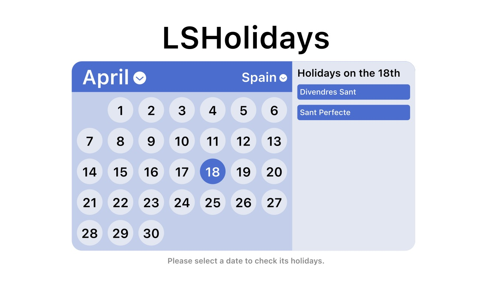

# LSHolidays
CA1 for Web Projects II (2024-2025)

Important note: this graded exercise must be done individually.

Let’s be real - between endless assignments, quizzes, and lectures that somehow always start way too early, the true highlights of student life are holidays. And that’s exactly what this exercise is all about!
Welcome to LSHolidays, where you will have to build a PHP web page that displays a calendar to showcase all the national holidays using the Calendarific API. Plan your procrastination wisely with LSHolidays!

## Pre-requisites and requirements

To be able to create this web app, you are going to need a local environment suited with:

1. Web server (Nginx)
2. PHP 8
3. MySQL
4. Composer

You have to use the Docker `local-environment` set up that we have been using in class. It should be enough for your needs.

## Resources

### MySQL

Use the [schema.sql](./resources/schema.sql "Schema SQL") provided as part of this exercise to create the tables in the MySQL database.

### Guzzle

You will need to request information from an external API during the exercise. You MUST use [Guzzle](https://docs.guzzlephp.org/en/stable/).

## Exercise

To complete the exercise, you will need to create three different pages:

1. Register
2. Login
3. Calendar

### Register

For this page, you have to create a file called `register.php` that displays a register form containing two fields:

1. Email - must be a valid email
2. Password - must contain at least one number, one capital letter, and should be longer than or equal to 9 characters

When the form is submitted, you need to validate the data from the form. All the validation errors must be displayed under the corresponding input field.
If the registration is successful, you need to [(HTTP) redirect](https://developer.mozilla.org/en-US/docs/Web/HTTP/Redirections) the user to the login page.

### Login

For this page, you have to create a file called `login.php` that is going to display a login form containing two fields:

1. Email
2. Password

When the form is submitted, you need to validate the data from the form **using the same validations as in the registration**. All the validation errors must be displayed under the corresponding input field.

If all the data is correct, you will have to check if the user exists in the database to log him in (**you need to start a session for the user**). If the user is not found, you need to display an error in the form.

### Calendar

If users try to manually access to this page without being logged in, they should be redirected to the login page.

For this page, you have to create a file called `calendar.php` that is going to display a calendar with a month selector and displaying all its days in a grid. When a day is selected, any holidays should be displayed next to the calendar.



For this calendar to work, an **API call** should be made when the user selects a month, requesting all its holidays. These should be stored so that when the user presses on a day which contains a holiday, it is shown next to the calendar. It is suggested that the days that do have holidays are highlighted on the calendar to avoid pressing on days that have no holidays.

To use the **Calendarific API**, first you need to [sign up for free](https://calendarific.com/register) and then get the API key on the [dashboard](https://calendarific.com/account/dashboard). Note that there is a maximum of 500 requests per month, so use them wisely to make the calls to the Holidays calendar.

```
$apiUrl = "https://calendarific.com/api/v2/holidays";
```

For authentication, use your API key to add it to the request parameters. For more information, checkout the [documentation](https://calendarific.com/api-documentation).

It is required to at least use the country parameter in the API to show holidays from all the countries available. Optionally, you are free to use any other parameters to either filter or add more functionality to the calendar holidays. Check the documentation to see all the available ones!

## Delivery

### Requirements

Besides using Guzzle, you MUST use the structures available in Object-Oriented Programming, at least classes and objects.

### Format

You must upload a .zip file with the filename format `AC1_<your_login>.zip` containing all the code to the eStudy.
